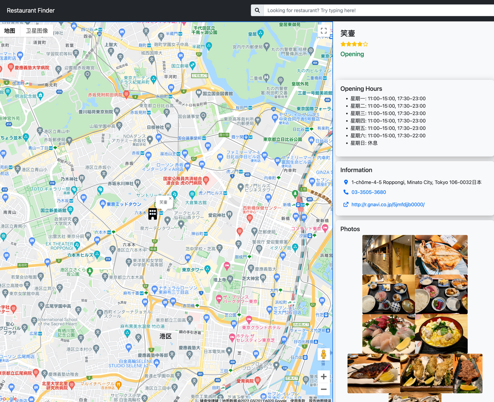

# Restaurant Finder

This is a web app that helps you shuffle a restaurant out of all options in the area near your office. Alternatively, you can
search and pick one out by yourself.

[Try it out](https://restaurant-finder-kappa.vercel.app/)

### DeskTop




### Mobile


## Features

- Randomly select 20 restaurants within the 1 KM radius of the office. Shuffle one out of them displays at the top.
- Show the detail of the restaurant when clicking the card
- Show the current status of the restaurant as well as the opeing hours
- Show photos as well as use reviews and other information such as address, phone number and homepage
- Search for different restaurants with names, food or address on top.
- Responsive design and optimized for screens of all sizes.

## Getting Started

To deploy locally, you need a Google Maps api key. Create a `.env` and stores it as follows

```
GOOGLE_MAP_API=<GOOGLE_MAP_API>
```

In addition, you need to set the center position, this is where the app would base on to search restaurants

```
CENTER_LAT=<CENTER_LAT>
CENTER_LNG=<CENTER_LNG>
```

Here are some commands

```
yarn # install dependencies
yarn dev # develop server
yarn test # run unittests with jest
yarn e2e # run e2e tests with cypress
yarn build # build the project
yarn start # start the build
```

Or, you can just use it [here](https://restaurant-finder-kappa.vercel.app/).

## Tech stack

This project was built with react and next.js. For the map and keyword search, Google Maps api is implemented. Here are
main dependencies.

- fontawesome: For icons
- react-google-maps/api: Provides plug and play React components of Google Maps api
- react-bootstrap: Provides basic UI component
- bootstrap: Provides basic style
- nanoid: A lightweight id generator

Other dependencies include:

- jest: For unittest
- cypress: For E2E test
- eslint: For style check
- prettier: For code reorganization

You can see the full dependency list at `package.json`

## Architecture Walk through

This entire app is built around the Google Maps api as it provides both the map function as well as the search function.

Initially, we need a list of restaurant within the 1 km radius of the office. This can be achieved by using the `nearBySearch` feature. When a user
clicks a restaurant, we need to get the details of the restaurant. So the `getDetails` api is used. To perform a keyword search, the `textSearch` api is used.
So we have three methods responsible for getting data from Google Maps

```typescript
// ./lib/repositories
// Responsible for getting restaurant list
// within the 1km radius of the office
const getRestaurantsWithinRange = (
  // the type is hard coded as 'restaurant' when called
  // so that it would only return restaurant result
  type: string,
  // the radius is hard coded as 1000 when called,
  // so that it would only return restaurant within 1km radius
  radius: number,
) => {
  /* ... */
};

// Responsible for getting the restaurant details
const getResuaurantDetails = (
  // The placeId derived from Google Maps api
  placeId: string,
) => {
  /* ... */
};

// Responsible for keyword search
const querySearch = (
  // The keyword for searching
  keyword: string,
) => {
  /* ... */
};
```

This web app contains 4 main components: `TopBar`, `MapView`, `RestaurantList` and `RestaurantDetail`. Some of the states must be shared among components. Using Redux
for project at this scale is a little overkill so instead the context api of React is implemented. The following states and function are shared among components.

```typescript
// ./lib/entities/MapContext.js
type MapContextType = {
  // Restaurant list return from Google Maps api
  restaurants: Restaurant[] | [];
  setRestaurants: (restaurant: Restaurant[]) => void;
  // indicates if the map is being loaded, if it is, a spinning animation will be displayed
  isLoaded: boolean;
  // the map instance, which is needed for the placeServices instance
  map: google.maps.Map | null;
  setMap: (map: google.maps.Map | null) => void;
  // placeServices is a instance of RestaurantsRepository
  placeServices: RestaurantsRepository | null;
  setPlaceServices: (repo: RestaurantsRepository) => void;
  // keyword that use inputs
  keyword: string;
  setKeyword: (word: string) => void;
  // indicates if there is an error when accessing Google Maps api, if there is, an error info will be displayed
  apiError: boolean;
  setApiError: (val: boolean) => void;
  // indicates if there is no search result, if there is no result, a no result info will be displayed
  noResult: boolean;
  setNoResult: (val: boolean) => void;
  // indicates if the search is in progress, if it is, a spping animation will be displayed
  isSearching: boolean;
  setIsSearching: (val: boolean) => void;
};
```

## Possible Improvements

- Currently, when users return from the detail page, the app would call the `querySearch` method to get the result again. This is due to that `restaurant`
  state is set to the selected one when clicking a restaurant.

```typescript
// ./pages/details/[id].tsx
try {
  const data = await placeServices?.getRestaurantDetails(id);
  if (!data) return;
  setDetails(data);
  setRestaurants([data.basicInfo]);
} catch (e) {
  if (e === google.maps.places.PlacesServiceStatus.INVALID_REQUEST) {
    setApiError(true);
  }
```

This makes it easier to implement the Marker on the map so that it can display and center the selected restaurant. On the other hand, `restaurant` gets
reset every time when clicking a restaurant and in return have to query the API again when going back to the main page. So it would stress the api more.

- The marker can not be clicked, it would be a better user experience if the marker on the map can be clicked directly.
- Search based on current location would be nice
- The search result would be in whatever the language in the `Accept-Language` header. It would be nice if the user can choose the language.

## Something nice about this PJ

- Even this is just a small project, cypress and jest are still integrated.
- ESLint and prettier are also configured
- Mobile first responsive design makes it easier to be used on mobile devices.
- GitHub's actions are configured so that CI/CD can be quite easy.
- Written with TypeScript and achieved complete separation of the front-end and the back-end, combining with automated testing and eslint, it is very easy
  to scale up and add more features.
